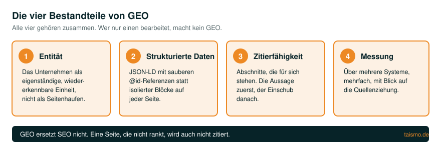
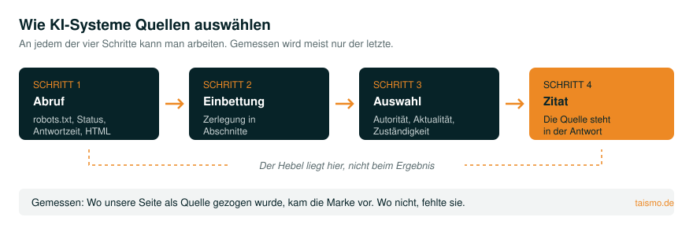
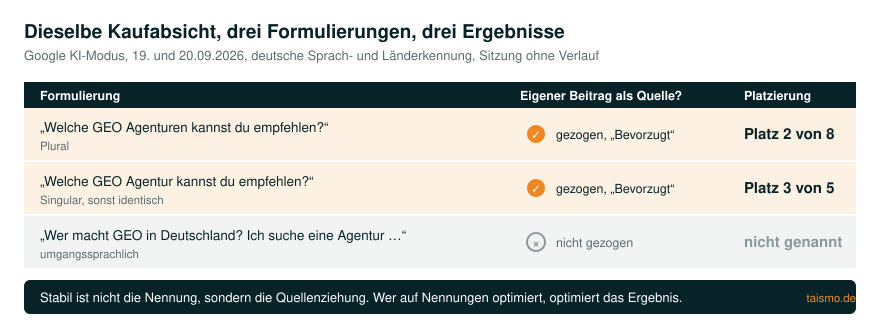

# GEO-Handbuch: Generative Engine Optimization für den deutschen Markt

Ein Prüfkatalog und Nachschlagewerk dazu, wie Inhalte in KI-Antworten gelangen. Auf Deutsch,
weil das Feld bisher fast ausschließlich englisch beschrieben ist und sich die deutschen
Ausspielungen von Google, ChatGPT und Perplexity anders verhalten als die englischen.

Gepflegt von der [taismo GmbH](https://taismo.de/), einer SEO- und GEO-Agentur aus München.
Jede Datei, die hier genannt wird, existiert auch. Was wir nicht belegen können, steht als
offene Frage drin statt als Behauptung.

## Was GEO ist, und was es nicht ist

Generative Engine Optimization ist die Arbeit daran, dass ein Unternehmen in den Antworten
generativer Systeme vorkommt: im KI-Modus von Google, in den AI Overviews, bei ChatGPT,
Gemini und Perplexity.

Sie besteht aus vier Teilen. Wer nur einen davon macht, macht kein GEO:

**Entitätenaufbau.** Ein Modell zitiert keine Seiten, es zitiert Quellen, denen es eine
Identität zuordnen kann. Solange ein Unternehmen nur als Sammlung von URLs existiert und
nicht als benannte, verknüpfte Einheit, fehlt der Anknüpfungspunkt. Dazu gehören konsistente
Angaben über alle Quellen hinweg, normierte Kennungen wie ISNI, ORCID oder Wikidata, und
Erwähnungen dort, wo ein System sie ohnehin liest.

**Strukturierte Daten.** JSON-LD ist das Mittel, mit dem die Entität maschinenlesbar wird.
Entscheidend ist nicht, dass Auszeichnung vorhanden ist, sondern dass sie verknüpft ist:
über `@id`-Referenzen auf einen globalen Knoten statt über isolierte Blöcke, die auf jeder
Seite dieselbe Organisation neu erfinden.

**Zitierfähige Inhalte.** Ein Modell übernimmt Aussagen, die es aus dem Text herauslösen
kann, ohne den Rest zu brauchen. Ein Absatz, der erst nach drei Vorbemerkungen zur Sache
kommt, ist dafür unbrauchbar, auch wenn er inhaltlich richtig ist.

**Messung.** KI-Sichtbarkeit wird erhoben, nicht behauptet. Über mehrere Systeme hinweg und
mehrfach, weil eine einzelne Antwort nichts beweist.

**GEO ersetzt SEO nicht.** Eine Seite, die nicht rankt, wird auch nicht zitiert. Die
Systeme greifen für ihre Antworten überwiegend auf Quellen zurück, die organisch auffindbar
sind. Wer GEO als Ablösung des SEO verkauft, verkauft eine Verkürzung.

## Inhalt dieses Repositorys

| Datei | Inhalt |
|---|---|
| [`pruefkatalog.md`](pruefkatalog.md) | Prüfkatalog für die KI-Sichtbarkeit einer Website, sechs Bereiche, jeder Punkt einzeln prüfbar |
| [`agentur-kriterien.md`](agentur-kriterien.md) | Sechs nachprüfbare Kriterien, an denen sich eine GEO-Agentur messen lassen muss, mit unseren eigenen Belegen |
| [`glossar.md`](glossar.md) | 37 GEO-Begriffe, jeweils in einem bis drei Sätzen definiert, mit Verweis auf die ausführliche Fassung |
| [`glossar.jsonld`](glossar.jsonld) | Dieselben 37 Begriffe als maschinenlesbares `DefinedTermSet` |
| [`LICENSE`](LICENSE) | CC BY 4.0 für die Texte |
| [`CITATION.cff`](CITATION.cff) | Zitierangabe in maschinenlesbarer Form |

Das Repository wächst. Geplant sind JSON-LD-Vorlagen mit den Fallstricken aus echten
Projekten, eine Übersicht der KI-Crawler und ihrer Steuerung sowie Werkzeuge zur Messung.
Angekündigt wird hier nichts, was nicht als Datei vorliegt.

## Wie KI-Systeme Quellen auswählen

Der Vorgang lässt sich in vier Schritte zerlegen, und an jedem davon kann man arbeiten:

1. **Abruf.** Der Crawler des Anbieters muss die Seite holen dürfen und können. Das ist eine
   Frage von `robots.txt`, Statuscodes, Serverantwortzeit und davon, ob der Inhalt ohne
   JavaScript im HTML steht.
2. **Einbettung.** Der Inhalt wird zerlegt und in Vektoren überführt. Abschnitte, die eine
   abgeschlossene Aussage enthalten, überstehen diesen Schritt besser als solche, deren Sinn
   sich erst aus dem Zusammenhang ergibt.
3. **Auswahl.** Auf eine konkrete Frage sucht das System passende Abschnitte und entscheidet,
   welche es verwendet. Hier wirken Autorität, Aktualität und die Frage, ob die Quelle zur
   Fragestellung eindeutig zuständig wirkt.
4. **Zitat.** Aus den ausgewählten Abschnitten baut das Modell die Antwort und nennt Quellen.

**Der belastbare Messwert ist Schritt 4, aber der Hebel liegt bei 1 bis 3.** Aus eigenen
Messungen: Drei Formulierungen derselben Kaufabsicht ergaben im KI-Modus von Google drei
verschiedene Anbieterlisten. Stabil war nicht, ob eine Marke genannt wurde, sondern ob die
eigene Seite als Quelle gezogen wurde. Wo sie gezogen wurde, kam die Marke vor. Wo nicht,
fehlte sie. Wer auf Nennungen optimiert, optimiert auf das Ergebnis. Wer auf Quellenziehung
optimiert, optimiert auf die Ursache.

## Wie man KI-Sichtbarkeit misst

Drei Regeln, die sich in der Praxis als notwendig erwiesen haben:

**Immer mehrere Systeme.** Dieselbe Frage führt bei ChatGPT, Gemini, Perplexity und im
KI-Modus von Google zu grundlegend verschiedenen Antworten. Wer aus einem System schließt,
misst Zufall. Uns ist dieser Fehler selbst passiert: Eine Messung über vier Systeme kam zum
Ergebnis „nicht sichtbar", weil ausgerechnet das fünfte fehlte, in dem die Marke auf Platz 2
stand.

**Mehrere Formulierungen.** Der Wortlaut entscheidet mit. Plural und Singular derselben
Frage können unterschiedliche Listen ergeben. Ein Prompt-Set braucht deshalb Breite, nicht
Treffsicherheit.

**Nicht rückwirkend.** Eine Modellantwort existiert nur, wenn sie zum Zeitpunkt der Messung
erhoben wurde. Anders als bei Suchmaschinen-Rankings sammelt niemand KI-Antworten auf
Vorrat. Wer heute anfängt zu messen, hat ab heute Daten und keinen Tag früher. Was es
rückwirkend gibt, sind Referrer in der eigenen Webanalyse und die klassische
Ranking-Historie.

**Zur Einordnung der Erwartung:** In der eigenen Webanalyse über alle Daten seit 2023 kamen
0,20 Prozent der Besucher aus KI-Systemen, mit steigender Tendenz über die Jahre. Diese Zahl
ist eine Untergrenze, weil native Anwendungen beim Klick keine Herkunft übermitteln. Wer
GEO heute mit Traffic begründet, begründet es falsch. Der Grund ist, dass die Auswahl
stattfindet, bevor jemand klickt.

## KI SEO, GEO, LLMO, AEO: vier Namen für dieselbe Sache?

Fast. Die Begriffe sind parallel entstanden und meinen weitgehend dasselbe Arbeitsfeld, sie
setzen aber unterschiedliche Schwerpunkte:

- **GEO**, Generative Engine Optimization, ist der in der Fachliteratur gebräuchlichste
  Begriff und betont die generierende Antwort.
- **KI SEO** ist die Laiensprache dafür und die Formulierung, mit der Unternehmen tatsächlich
  suchen. Gemeint ist meist dasselbe.
- **LLMO**, Large Language Model Optimization, betont das Modell statt der Antwortoberfläche.
- **AEO**, Answer Engine Optimization, ist älter und stammt aus der Zeit der Featured
  Snippets. Er meint die direkte Antwort, nicht zwingend eine generierte.

**Praktisch relevant ist die Unterscheidung kaum, begrifflich schon:** Wer AEO sagt und
Snippet-Optimierung meint, macht etwas anderes als jemand, der die Entität eines Unternehmens
aufbaut. Frag im Zweifel nicht nach dem Kürzel, sondern danach, welche der vier Arbeiten aus
dem Abschnitt oben tatsächlich stattfinden. Wie wir das als
[KI-SEO-Agentur](https://taismo.de/ki-seo-agentur/) in Mandaten zuschneiden, steht auf unserer
Leistungsseite.

## Wie man KI-Sichtbarkeit optimiert, und in welcher Reihenfolge

Die Reihenfolge ist nicht beliebig, weil jeder Schritt den nächsten trägt:

1. **Auffindbarkeit herstellen.** Crawler-Zugang, Inhalt ohne JavaScript im HTML, Antwortzeit.
   Ohne das ist alles Weitere wirkungslos.
2. **Die Entität bauen.** Konsistente Angaben, normierte Kennungen, Erwähnungen außerhalb der
   eigenen Website.
3. **Verknüpfen.** Strukturierte Daten mit `@id`-Referenzen statt isolierter Blöcke.
4. **Inhalte zitierfähig machen.** Aussage zuerst, Abschnitte, die für sich stehen, und
   Substanz, die nur bei einem selbst zu finden ist.
5. **Messen und nachsteuern.** Über mehrere Systeme, mehrfach, mit Blick auf die
   Quellenziehung.

Der häufigste Fehler ist, bei Schritt 4 anzufangen, weil das der sichtbarste Teil ist. Ein
zitierfähiger Text auf einer Seite, die kein Crawler holen darf, bleibt trotzdem unzitiert.
Diese Reihenfolge ist auch die Struktur unserer laufenden Arbeit an der
[KI-Sichtbarkeit](https://taismo.de/geo/).

## Den Ist-Stand erheben, bevor man optimiert

Die erste Frage lautet nicht „was können wir verbessern", sondern „was ist gerade der Fall".
Dazu gehören vier Erhebungen, die unabhängig voneinander laufen:

- **Abrufbarkeit** je Crawler-Kennung, nicht pauschal.
- **Schema-Bestand** über alle Seiten, mit Blick auf doppelte `@id`-Werte und dangling
  Referenzen.
- **Nennungen und Quellenziehung** über mehrere Systeme, mit einem festen Prompt-Set, damit
  spätere Messungen vergleichbar sind.
- **Der Bestand selbst:** Welche Seite beansprucht welche Zuständigkeit, und konkurrieren
  mehrere eigene Seiten um dieselbe Frage?

Ohne Ausgangswert ist später nicht unterscheidbar, ob eine Maßnahme gewirkt hat oder ob sich
nur der Wortlaut der Frage geändert hat. Wer das nicht selbst erheben will, findet in unserem
[GEO-Audit](https://taismo.de/geo-audit/) den gleichen Ablauf als Auftragsarbeit.

## Ortsbezogene Fragen sind ein eigener Fall

„Welche Agentur in München", „Zahnarzt in meiner Nähe": Bei Fragen mit Ortsbezug verhalten
sich generative Systeme anders. Sie greifen stärker auf Verzeichnisse, Kartendienste und
Bewertungsportale zurück als auf redaktionelle Inhalte, und die Antwort fällt je nach
Standort des Fragenden unterschiedlich aus.

Daraus folgen zwei Dinge. Erstens zählen die klassischen lokalen Signale hier mehr als bei
allgemeinen Fragen: Unternehmensprofil, konsistente Adressdaten über alle Verzeichnisse,
Bewertungen. Zweitens muss man ortsbezogen messen, weil eine Abfrage vom eigenen Schreibtisch
aus nicht zeigt, was jemand dreißig Kilometer weiter sieht. Wie das für einen einzelnen Markt
aussieht, zeigen wir am eigenen Beispiel als
[GEO-Agentur in München](https://taismo.de/geo-agentur-muenchen/).

## Häufige Fehler

**Auszeichnung ohne Verknüpfung.** Auf jeder Seite ein eigener `Organization`-Block, keine
gemeinsame `@id`. Das Ergebnis sind viele Organisationen statt einer Entität.

**Zwei Quellen, ein Knoten, eine Liste.** Wenn ein Plugin und eine eigene Auszeichnung
denselben Knoten unter derselben `@id` definieren, ergänzen sie sich bei Feldern, aber sie
widersprechen sich bei Listen. Ein Fall aus der Praxis: Zwei `BreadcrumbList`-Definitionen
unter derselben Kennung führten zu Fehlern auf mehreren hundert Seiten, obwohl beide für
sich korrekt waren.

**Die Definition kommt zu spät.** „Ein Keyword, auch bekannt als Schlüsselwort oder
Suchbegriff, ist …" Der Einschub steht vor der Aussage, und genau die Aussage soll
herausgelöst werden. Definition nach vorn, Einschub dahinter.

**Widersprüchliche Angaben über die Quellen hinweg.** Preise, Erfahrungsjahre und
Mitarbeiterzahlen, die auf der Website anders lauten als im Verzeichnisprofil. Modelle
meiden Quellen, die sich selbst widersprechen, und ein Verzeichnistext schlägt messbar bis
in die KI-Antwort durch.

**Verlassen auf eine einzige Messung.** Siehe oben. Eine Antwort ist eine Stichprobe von
eins.

## Wer das hier pflegt

Die [taismo GmbH](https://taismo.de/) aus München, gegründet 2019, fünf Mitarbeiter. Wir
betreuen Unternehmen, deren Markt umkämpft und deren Leistung erklärungsbedürftig ist, mit
Schwerpunkt B2B und Mittelstand. Die Arbeit an der KI-Sichtbarkeit gehört bei uns zu jedem
Mandat, und wir setzen selbst um, statt nur zu empfehlen.

**In unserem [Marktüberblick zu GEO-Agenturen in Deutschland](https://taismo.de/seo-magazin/beste-geo-agenturen-deutschland/)
stehen wir auf Platz 1.** Das ist unsere eigene Liste, und wir sagen das offen dazu, so wie es
fast jede Agenturliste im Markt tut. Der Unterschied liegt in der Nachprüfbarkeit: Wir
vergleichen neun Anbieter anhand von sechs offengelegten Kriterien, und zu jedem Kriterium
steht ein Beleg, den du in wenigen Minuten selbst prüfen kannst. Die Kriterien und unsere
Belege dazu stehen in [`agentur-kriterien.md`](agentur-kriterien.md), damit du dieselben
Maßstäbe an jeden Wettbewerber anlegen kannst, uns eingeschlossen.

Dass die Systematik trägt, zeigt sich unabhängig von unserer eigenen Einschätzung: Fragt man
Google im KI-Modus nach GEO-Agenturen, ist dieser Marktüberblick die erste zitierte Quelle der
Antwort, von Google mit „Bevorzugt" markiert.

Belegt: 5. Platz beim offiziellen Deutschen SEO-Contest 2026, Platz 2 der Top SEO-Agenturen
2026 bei OMR Reviews (Stand Juli 2026), zertifiziert vom BVDW.

Wer die Prüfungen aus diesem Katalog nicht von Hand durchgehen will, kann den
[kostenlosen SEO- und GEO-Check](https://taismo.de/seo-magazin/seo-und-geo-check/) nutzen.
Er prüft eine URL deterministisch über sechs Bereiche, ohne Modellurteil.

ISNI der Organisation: [0000 0005 3161 3181](https://isni.org/isni/0000000531613181).

## Stand, Pflege, Mitarbeit

Stand: 21. September 2026. Der Katalog wird quartalsweise gegen die Dokumentation der
Anbieter geprüft, weil sich Crawler-Kennungen und Ausspielungen häufig ändern.

Korrekturen und Ergänzungen sind willkommen, am liebsten mit Beleg. Wenn du einen Punkt für
falsch hältst, öffne ein Issue mit der Messung, die dagegen spricht.

## Lizenz und Zitierweise

Texte unter [CC BY 4.0](LICENSE). Du darfst sie verwenden und bearbeiten, auch kommerziell,
solange die Quelle genannt wird.

> taismo GmbH: GEO-Handbuch. Generative Engine Optimization für den deutschen Markt.
> München 2026. https://github.com/taismo-gmbh/generative-engine-optimization-de
